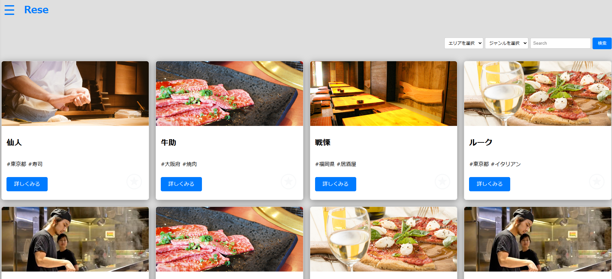
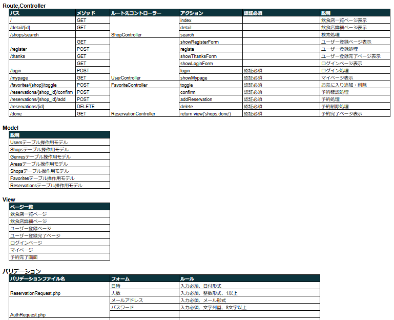
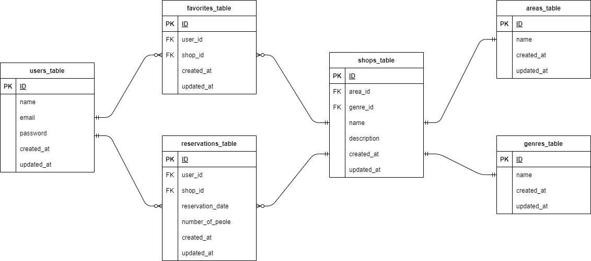

# Rese
本アプリは登録されている飲食店の予約を行うアプリです。 
 

## 作成した目的
外部の飲食店予約サービスは手数料を取られるため、自社で予約サービスを持つことを目的として本アプリが作成されました。

## アプリケーションのURL
アプリケーションのURL：http://localhost/ 
phpMyAdminのURL：http://localhost:8080/

環境構築後にログインする際は、以下のメールアドレスとパスワードをご利用ください。
メールアドレス：testuser@test.com パスワード：test1234

## 他のリポジトリ
機能一覧
・会員登録 ・ログイン ・ログアウト ・ユーザー情報取得 ・ユーザー飲食店お気に入り一覧取得 ・ユーザー飲食店予約情報取得 ・飲食店一覧取得 ・飲食店詳細取得
・飲食店お気に入り追加　・飲食店お気に入り削除　・飲食店予約情報追加　・飲食店予約情報削除　・エリアで検索する　・ジャンルで検索する　・店名で検索する

## 使用技術
・Laravel 8.8 ・php 7.4.9 ・MySQL 8.0

## テーブル設計

## ER図

## 環境構築
Docker ビルド 
1.git clone リンク：https://github.com/aki-369/Rese.git 
2.docker-compose up -d --build

※MySQlはOSによって起動しない場合があるので、それぞれの PC に合わせて「docker-compose.yml」ファイルを編集してください。

## Laravel 環境構築
1.docker-compose exec php bash 
2.composer install 
3.「.env.example」ファイルから「.env」 を作成し、環境変数を構築 
4.php artisan key:generate 
5.php artisan migrate 
6.php artisan db:seed